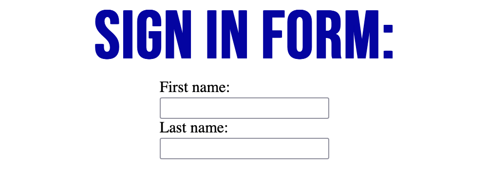

## What I've learned:
- I wanted to make the form centered, and didnt know how? The div that holds the form is the one that needs styling.



```html
<div class="form-wrapper">
    <form class="form-container">
        <label for="fname">First name:</label><br>
        <input type="text" id="fname" name="fname"><br>
        <label for="lname">Last name:</label><br>
        <input type="text" id="lname" name="lname">
    </form>
</div>
```
```css
.form-wrapper{
    display: flex;
    justify-content: center;
}
```